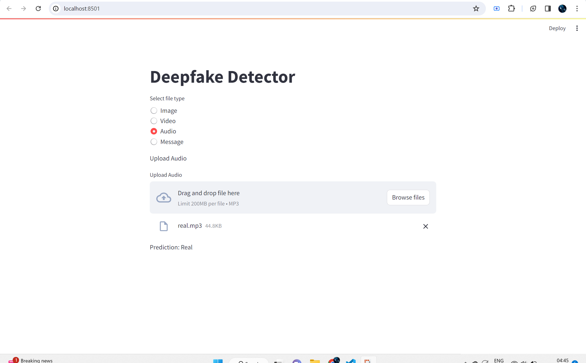

# Error404 DeepFake Detection

## Introduction to DeepFake
DeepFake involves the use of artificial intelligence (AI) and deep learning techniques to generate convincing fake content, spanning images, videos, audio, and messages. The technology has the capability to create content that appears authentically real.


## Team Members
- Suhaani Aggarwal
- Himanshu Agarwal
- Aditya Arockiadass

## Types of DeepFake
- Image
- Video
- Audio

## Project

## Image Detection
We embarked on our project with a focus on DeepFake detection in images. 
In the "Kaggle DeepFake Challenge" dataset, our model achieved an accuracy of 54%, with the highest accuracy in the challenge for this datset recorded at 65%.

### Technique Used
1. **CNN Based**
- Detection of faces in images using OpenCV Haar Cascade Classifier
- Cropping only the face part
- 90% faces detected in the Real image dataset
- 50% faces detected in the Fake image dataset

We leveraged this new data to train a Convolutional Neural Network (CNN) model, fine-tuning parameters to enhance accuracy from 50% to 54%.

1. **Transfer Learning**
- Detection of faces in images using face_recognition
- Training the CNN Model
- Using this model to then do tranfer learning
- Feeze upper layers to prevent overfitting

## Audio Detection

### Techniques Used

1. **Spectrogram-based Model**
   - Utilized the spectrogram of audio to train a Convolutional Neural Network (CNN) model.
   - Achieved an accuracy of 65%.

2. **Feature Extraction and Machine Learning**
   - Extracted 26 key features from audio signals.
   - Saved these features in a CSV file.
   - Employed various machine learning algorithms, with Random Forest achieving an accuracy of 86%.

3. **Dense Neural Network Model**
   - Used the 26 key features obtained from audio signals.
   - Trained a dense neural network model.
   - Achieved an impressive accuracy of 92.6% (The overall accuracy achieved globally is 96.1%)

### Dataset Source
The audio dataset used for training and testing was sourced from the "Kaggle DeepFake Challenge".

## Video Detection

### Techniques Used

   - Divided the whole video into frames
   - Used the fake image detection model to on these images
   - Compared the similarity between adjacent frames
   - Trained a CNN Model
   - Detected based on Similarity graph
   - Achieved a accuracy of 62% 


### Dataset Source
The audio dataset used for training and testing was sourced from the "Kaggle DeepFake Challenge".

## Example 
-Frontend : A audio file called real.mp3 is uploaded to check if it is DeepFake. Correct output.

-Similar can be followed for video and image

## Demonstration Video Link
- https://www.youtube.com/watch?v=bfdiBNi2yJU

## Project Structure
- .ipynb files used for model training
- .json and .h5 files to use the model
- frontend.py renders a stremlit page where in user can upload the files to check if its deepfake

## How to Run 
1. **Clone the Repository:**
   ```bash
   git clone https://github.com/Suhaani07/Error404-Deepfake-Project
2. **Navigate to the Repository:**
   ```bash
   cd Error404-DeepFake-Detection
3. **Run the Streamlit Page:**
   ```bash
   streamlit run frontend.py
4. **Upload the required file to test:**

## Train the .ipynb models
1. **Upload the ipynb file to Google Colab**
2. **Select Runtime as GPU**
3. **Run the Cells**
4. **If asked for kaggle login, login using username and API Key**

## License
This audio detection module is also lcensed under the [MIT License](LICENSE).

---
&copy; 2024 Error404 DeepFake Detection
